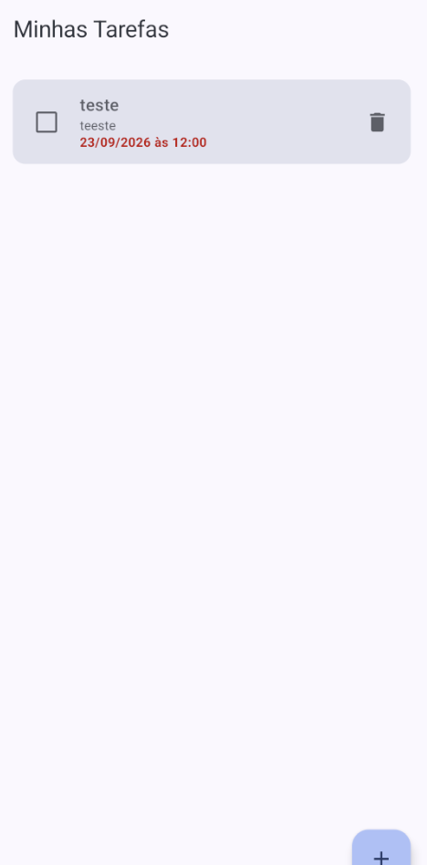
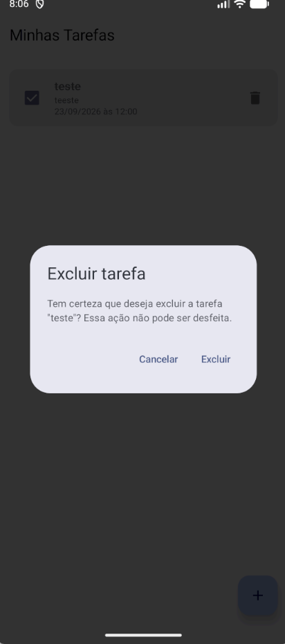
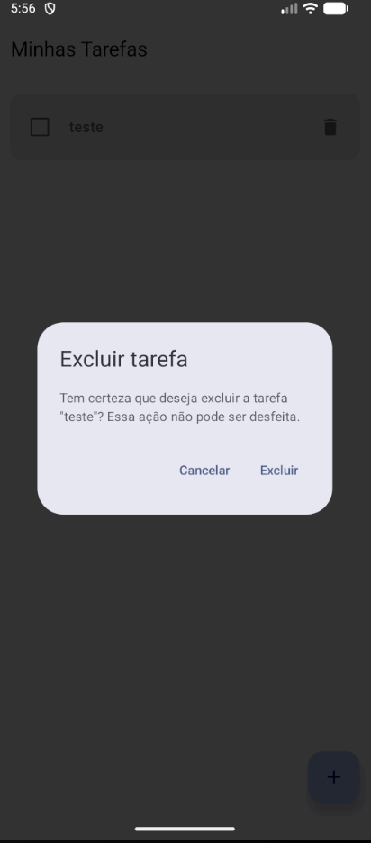
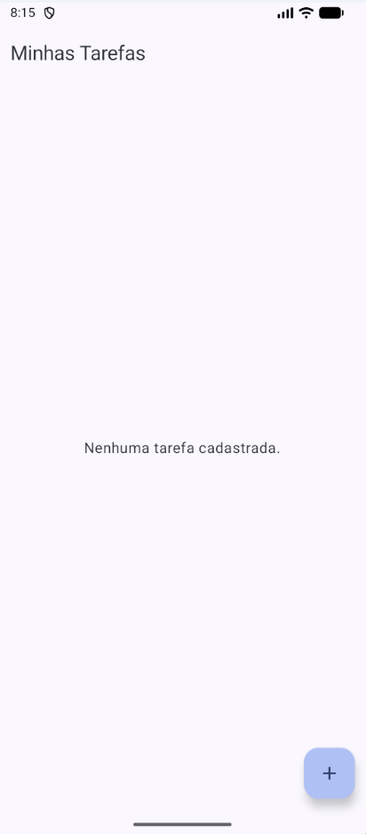

# Evidências — Confirmação de exclusão de tarefas

Sequência de telas do emulador demonstrando o fluxo de confirmação antes da exclusão de uma tarefa.

> ⚠️ Falta 1 dos 5 prints exigidos (item 3 abaixo). Veja a seção "Pendências" no fim deste arquivo.

## 1. Lista antes da exclusão

## 2. Diálogo aberto com a tarefa selecionada

## 3. Resultado ao cancelar

_Pendente — falta capturar a lista logo depois de tocar em **Cancelar** no diálogo, mostrando a tarefa intacta._

## 4. Nova abertura do diálogo

## 5. Resultado após confirmar a exclusão

---

## Pendências

- Falta o print do item **3** (resultado ao cancelar): a **lista**, sem o diálogo, logo após tocar em Cancelar — mostrando a tarefa intacta. Salve em `docs/images/exclusao/` e avise para eu atualizar este arquivo.
- `docs/images/exclusao/cancelar.png` foi enviado, mas mostra o diálogo ainda aberto (mesmo estado do item 2/4), não o resultado do cancelamento — por isso não está referenciado aqui.
- `docs/images/exclusao/criarNota.png` foi enviado mas mostra a tela de **criação de tarefa**, que não faz parte da sequência exigida (lista → diálogo → cancelar → diálogo → excluir). Não está referenciado aqui; pode remover o arquivo ou deixá-lo na pasta, como preferir.
